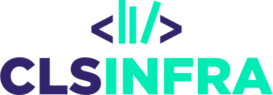

# What is eltec.clscor.io?
The eltec.clscor.io platform is a prototype that provides a basic implementation of the concept of Programmable Corpora for the European Literary Text Collection (ELTeC). The corpora provided by eltec.clscor.io are based on 'ELTeC core‘ (12 complete corpora in 12 different languages). The technology used by eltec.clscor.io is a spin-off of [dracor.org](https://dracor.org/).

# What is ELTeC? 
ELTeC is the *European Literary Text Collection*. It is one of the key deliverables of the COST Action [‘Distant Reading for European Literary History’ (CA16204)](https://www.distant-reading.net) that ran from 2017 to 2022. ELTeC is a collection of corpora of literary texts that are comparable in nature, scope and quality across several European languages. Its availability is an essential condition for the creation, evaluation and use of multilingual tools and methods of analysis for literary texts. Novels have been chosen among major literary genres for availability and size. Chronological limits are due to constraints related to copyright and availability of quality full texts.

# More Information on ELTeC
- An overview of the current state in ELTeC corpus building can be found here: [https://distantreading.github.io/ELTeC](https://distantreading.github.io/ELTeC)
- Work on the different ELTeC corpora is in progress here: [https://github.com/COST-ELTeC](https://github.com/COST-ELTeC)
- A collection of relevant documentation can be found here: [https://distantreading.github.io/](https://distantreading.github.io/)
- The schema files for the different levels of encoding are available as well: [https://github.com/COST-ELTeC/Schemas](ttps://github.com/COST-ELTeC/Schemas)
- ELTeC page on Zenodo, with archived releases, one for each corpus: [https://zenodo.org/communities/eltec/](https://zenodo.org/communities/eltec/)

# How to Cite
If you want to refer to ELTeC, we suggest to cite: 
- *European Literary Text Collection (ELTeC)*, version 1.1.0, April 2021, edited by Carolin Odebrecht, Lou Burnard and Christof Schöch. COST Action Distant Reading for European Literary History (CA16204). DOI: doi.org/10.5281/zenodo.4662444).
- See also the citation suggestions for individual ELTeC collections in their respective repositories on Github.

# Reference Publications: ELTec 
Please cite one or both publications if you use one or several of the corpora included in ELTeC:
- Lou Burnard, Christof Schöch, Carolin Odebrecht (2021): "In Search of Comity: TEI for Distant Reading". In: Journal of the Text Encoding Initiative 14. DOI: [10.4000/jtei.3500](https://doi.org/10.4000/jtei.3500).
- Christof Schöch, Roxana Patraș, Diana Santos, Tomaž Erjavec (2021): "Creating the European Literary Text Collection (ELTeC): Challenges and Perspectives". In: Modern Languages Open 1/25. DOI: [http://doi.org/10.3828/mlo.v0i0.364](http://doi.org/10.3828/mlo.v0i0.364)

# Reference Publications: DraCor and Programmable Corpora  
- Frank Fischer et al. (2019): "Programmable Corpora: Introducing DraCor, an Infrastructure for the Research on European Drama". In: Proceedings of DH2019: "Complexities", Utrecht. DOI: [10.5281/zenodo.4284002](https://doi.org/10.5281/zenodo.4284002).
- Ingo Börner, Peer Trilcke (2023): CLS INFRA D7.1: On Programmable Corpora. Report and Prototype (DraCor). Zenodo. DOI: [10.5281/zenodo.7664964](https://doi.org/10.5281/zenodo.7664964)
* Ingo Börner, Peer Trilcke (eds.) (2025): CLS INFRA D7.4: On the Implementation of Programmable Corpora. Report. Zenodo. DOI: [10.5281/zenodo.15301341](https://doi.org/10.5281/zenodo.15301341)

# Funding

In the context of [CLS INFRA](https://clsinfra.io/), the project has received funding from the European Union's Horizon 2020 research and innovation programme under grant agreement [No. 101004984](https://cordis.europa.eu/project/id/101004984).

eltec.clscor.io has benefited from "DraCorOS. Fostering Open Science in Digital Humanities". We acknowledge the OSCARS project, which has received funding from the European Commission’s Horizon Europe Research and Innovation programme under grant agreement No. 101129751.

